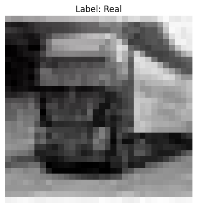
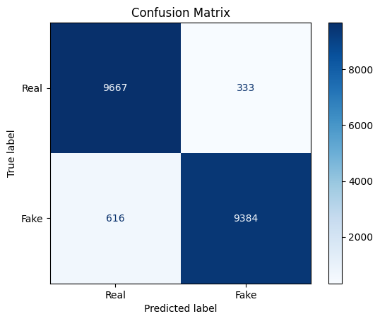
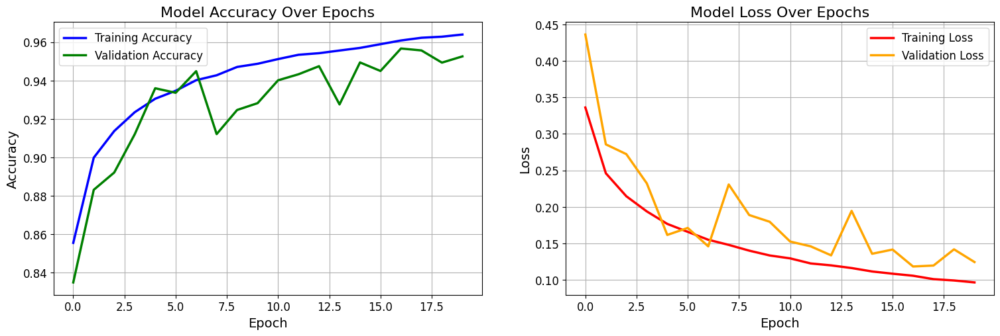

# Synthetic Image Detection: Deep Learning & Statistical Classifiers

[](https://www.python.org/)
[](https://www.tensorflow.org/)
[](https://scikit-learn.org/)
[](https://opensource.org/licenses/MIT)

## 🚀 Project Overview
This repository features a robust pipeline for detecting AI-generated synthetic images. Using the **CIFAKE dataset** (100,000 images), we compare state-of-the-art Deep Learning (CNN) with traditional Machine Learning baselines (SVM, MLP, Logistic Regression) to benchmark performance and reliability in the era of generative AI.

### Key Achievement:
*   **CNN Accuracy:** 95%
*   **Dataset:** CIFAKE (50k Real, 50k Synthetic)
*   **Pipeline:** End-to-end preprocessing, model training, and comparative evaluation.

## 💡 Motivation
The rapid advancement of Diffusion Models and GANs has made synthetic images nearly indistinguishable from reality. This project explores the "visual artifacts" that remain detectable by neural networks, providing an engineering solution to combat misinformation and verify content authenticity.

## 🏗 Architecture & Methodology
The project follows a tiered approach to classification:

1.  **Convolutional Neural Networks (CNN):** Optimized for spatial feature extraction using multiple convolutional layers, dropout for regularization, and batch normalization to ensure stable convergence.
2.  **Baselines:** Statistical benchmarks using flattened image features (Standardized RGB vectors) across:
    *   Support Vector Machines (SVM)
    *   Multi-Layer Perceptrons (MLP)
    *   Logistic Regression
    *   K-Means Clustering (Unsupervised approach)

### Proposed Pipeline Diagram
`Input (32x32x3) -> Preprocessing (Normalization) -> Model (CNN/SVM/MLP) -> Softmax/Sigmoid -> Binary Output (Real vs. Fake)`

## 🛠 Tech Stack
- **Languages:** Python
- **Deep Learning:** TensorFlow, Keras
- **Machine Learning:** Scikit-learn
- **Data Manipulation:** NumPy, Pandas
- **Visualization:** Matplotlib, Seaborn

## 📊 Performance Metrics
The CNN model significantly outperformed traditional methods, demonstrating the importance of spatial awareness in synthetic image detection.

### Training History

*Figure 1: Accuracy and Loss curves showing stable convergence over 20 epochs.*

| Model | Accuracy | F1-Score |
| :--- | :--- | :--- |
| **CNN** | **95.0%** | **0.95** |
| SVM | ~70-75% | Variable |
| MLP | ~80% | Variable |
| Logistic Regression | ~65% | Variable |

### Confusion Matrix (CNN)

*Figure 2: Confusion matrix showing high precision and recall for both Real and Fake classes.*

### Sample Predictions

*Figure 3: Visualizing model predictions on the test set.*

## 📂 Project Structure
```text
├── notebooks/
│   ├── 01_cnn_classification.ipynb      # Main Deep Learning model (95% Acc)
│   ├── 02_svm_classification.ipynb      # SVM Baseline
│   ├── 03_mlp_classification.ipynb      # Neural Network Baseline
│   ├── 04_logistic_regression.ipynb     # Linear Baseline
│   └── 05_kmeans_clustering.ipynb       # Unsupervised approach
├── README.md                            # Professional documentation
└── .gitignore                           # Standard Python ignores
```

## ⚙️ Getting Started
### 1. Prerequisites
- Python 3.8+
- TensorFlow 2.x
- Scikit-Learn
- Matplotlib, NumPy, Pandas

### 2. Dataset Setup
1. Download the **CIFAKE Dataset** from [Kaggle](https://www.kaggle.com/datasets/birdy654/cifake-real-and-ai-generated-synthetic-images).
2. Place the `archive.zip` in the root directory or extract it so that the structure is:
   ```text
   dataset/
   ├── train/
   │   ├── REAL/
   │   └── FAKE/
   └── test/
       ├── REAL/
       └── FAKE/
   ```
3. Update the `zip_filename` or `extract_path` in the notebooks if necessary.

## 🚀 Future Improvements
- **Transfer Learning:** Implementing ResNet50 or EfficientNet-B0 for higher resolution datasets.
- **Explainability (XAI):** Integrating Grad-CAM to visualize which regions of an image trigger "Fake" classifications.
- **Robustness Testing:** Evaluating performance against adversarial attacks and compression artifacts.
---
*Developed as part of a deep dive into AI Ethics and Computer Vision.*
